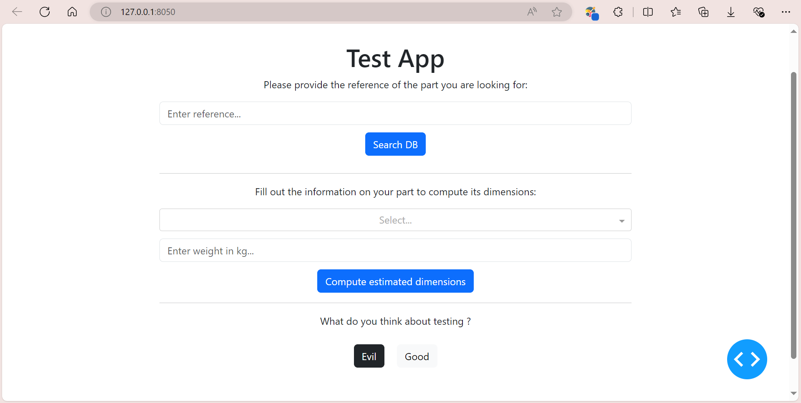

# Basic testing for Dash application

This repository contains a basic, example Dash app and some associated tests (display, unit, integration, end-to-end).

## Requirements

I used the packages pytest, requests, requests-mock and dash[testing] to build some basic examples of tests for a Dash application. You can install those packages in your environment by running the following command in your terminal:

```
pip install pytest requests requests-mock dash[testing]
```

Remember to also add to your project the conftest.py and pytest.ini files.

If you want to experiment with this repository, you can clone it, create a virtual environment (or not) and run this command:

```
pip install -r requirements.txt
```

Notes:

    - The dash.testing library uses selenium to run the end-to-end tests, and it needs a webdriver. I recommend downloading the Chrome Webdriver from[Downloads  |  ChromeDriver  |  Chrome for Developers](https://developer.chrome.com/docs/chromedriver/downloads).

## Basic App

To illustrate the types of tests you can implement in your Dash app, I started with a simple, minimal example application:



This app, designed to mimic the core functionalities of a real-world tool, has two main features:

1. **Database Query** : A feature that sends a request to a database to retrieve information about a specific part based on its reference number.
2. **Computation Algorithm** : A Python algorithm that calculates estimated dimensions of a part, given its weight and material properties.
3. **Context Dependent Display** : A Dash callback that displays different results according to its context.

## Test samples

You can find diverse test examples (display, unit, integration, end-to-end) in the `tests/` folder.
